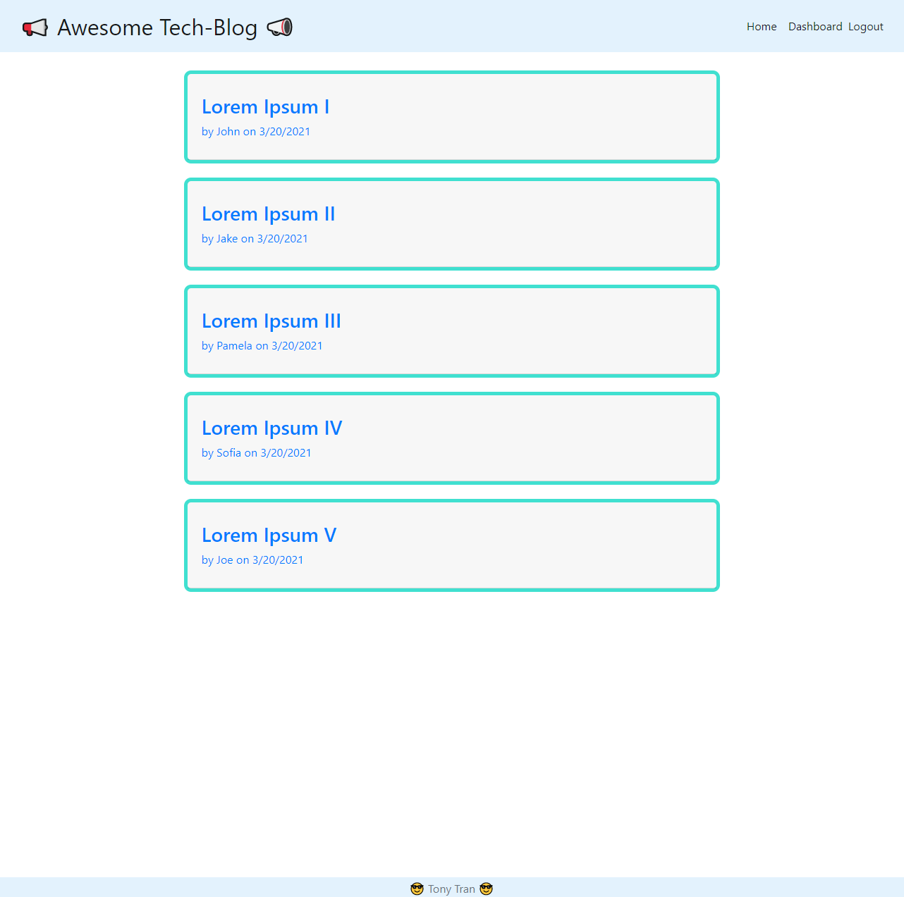
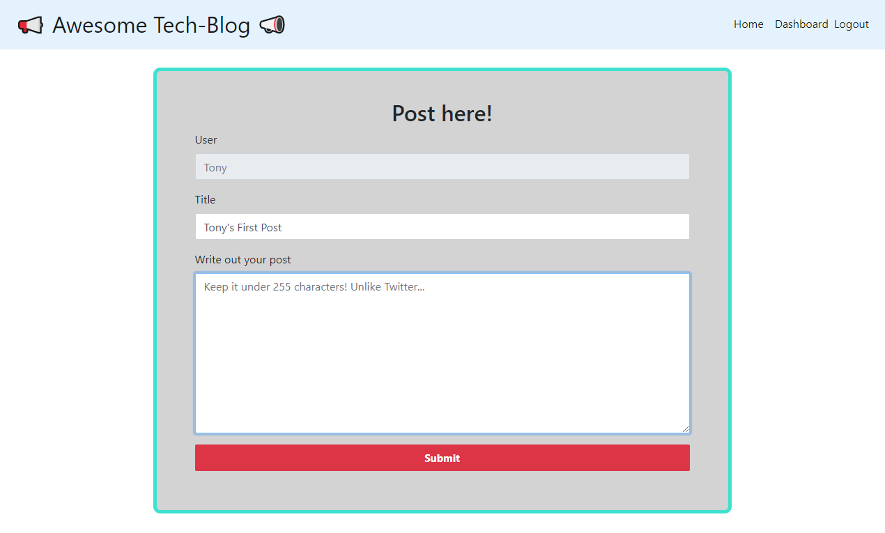

# Awesome MVC Tech Blog

License: 

## Description 

This awesome tech blog was inspired by the MVC paradigm and to communicate among our peers. This application was created using express-session npm for authentication and Handlebars.js as the templating engine behind the views. This application follows the Model-View-Controller paradigm and structure. Sequelize was used for the ORM. 

Screenshots:

## Table of Contents

* [Installation](#installation)
* [Usage](#usage)
* [License](#license)
* [Contributing](#contributing)
* [Tests](#tests)
* [Questions](#questions)

## Installation

You can use the deployed application at the link below in this readme. 

## Usage 

Here are some features of this application. 

  - able to view all blog posts on the server
  - sign up using their name, email, and password
  - post blog entries
  - comment on other blogs
  - delete your blog

Note: Application still requires modification to update to their own blog posts. ***

Deployed: https://awesome-tech-blog-mvc.herokuapp.com/

## License

MIT

## Contributing

If you would like to contribute to this project, you can fork a copy of the repo and make changes or improvements on your repo. Once ready, you can request a push and I will review the changes before updating the repo. 

## Tests

There are no tests with this application. Let me know if you are interested in creating a test for this application. 

## Questions

If you have any questions, feel free to contact me and listed below are my contact informations. 

GitHub profile: code-monkey713

Email: codemonkey713@gmail.com

References:

https://getbootstrap.com/docs/5.0/examples/
https://www.tutorialrepublic.com/snippets/preview.php?topic=bootstrap&file=simple-login-form
